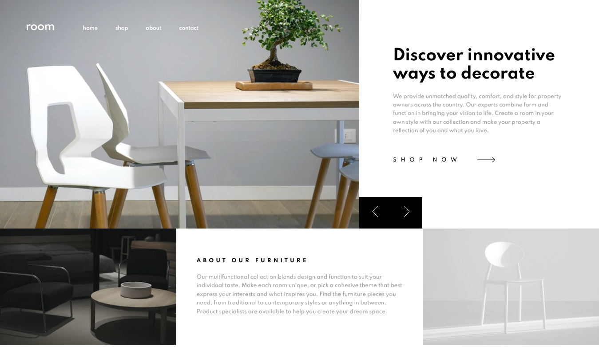
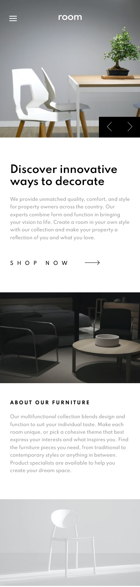

# Frontend Mentor - Room homepage solution

This is a solution to the [Room homepage challenge on Frontend Mentor](https://www.frontendmentor.io/challenges/room-homepage-BtdBY_ENq). Frontend Mentor challenges help you improve your coding skills by building realistic projects. 

## Table of contents

- [Overview](#overview)
  - [The challenge](#the-challenge)
  - [Screenshot](#screenshot)
  - [Links](#links)
- [My process](#my-process)
  - [Built with](#built-with)
  - [What I learned](#what-i-learned)
- [Author](#author)

**Note: Delete this note and update the table of contents based on what sections you keep.**

## Overview

### The challenge

Users should be able to:

- View the optimal layout for the site depending on their device's screen size
- See hover states for all interactive elements on the page
- Navigate the slider using either their mouse/trackpad or keyboard

### Screenshot





### Links

- Solution URL: [Solution](https://www.frontendmentor.io/solutions/css-grid-flexbox-vuecli-6RUE-ETqK)
- Live Site URL: [Live site](https://abdielp.github.io/vue-room-homepage/#/)

## My process

### Built with

- Semantic HTML5 markup
- CSS custom properties
- Flexbox
- CSS Grid
- Mobile-first workflow
- [Vue-CLI v3@](https://vuejs.org/) - JS library

### What I learned

This was my firts website with Vue.js Library. 
It uses some Vuejs basics, such as communication between components, events, data binding and Vue life cycle. 

Vue template syntax example: class binding and v-on event.
```html
<template>
  <header v-bind:class="{ header: toggle }">
    <nav class="navbar">
      <svg
        v-on:click="toggleNav()"
```
```js
export default {
  name: "Navigation",
  data() {
    return {
      toggle: false,
    };
  },
  methods: {
    toggleNav: function () {
      return (this.toggle = !this.toggle);
    },
  },
};
```
## Author

- Frontend Mentor - [@AbdielP](https://www.frontendmentor.io/profile/AbdielP)
- GitHub - [@AbdielP](https://github.com/AbdielP)
- Twitter - [@abdiel262](https://twitter.com/Abdiel262)
